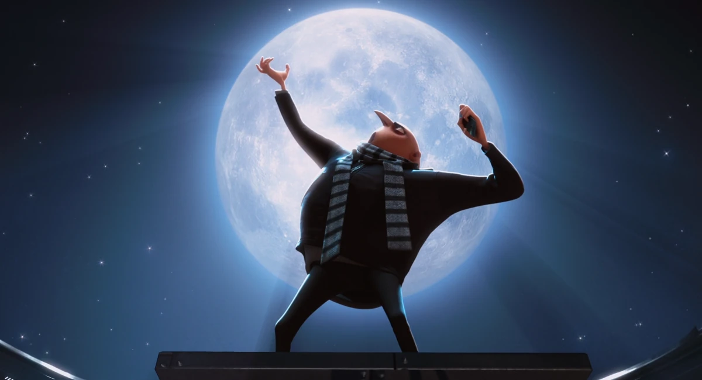
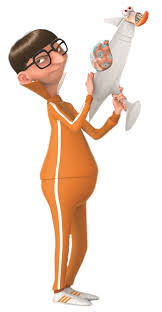

| Deliverable | Due Date              |
|---------------|----------------------------------------------------------------------------|
| Race Day | Saturday, May 10th 9AM - 24M EST |
| Code Pushed to Github  | Saturday, May 10th 1PM EST |
| Briefing (15 min presentation + 5 min Q&A) OR Report ([github pages](https://github.mit.edu/rss/website2021)) | Monday, May 5th at 1:00PM EST (NB: deadline is for briefing slides, briefings are from 3-5pm) |
| [Team Member Assessment](https://forms.gle/z4t7jNufTrGH2JX58)  | Monday, May 12th at 11:59PM EST |

# Final Challenge 2025

## Introduction

Congratulations on completing the six labs of RSS! 

This semester, you've learned how to implement real-time robotics software on a widely-used software framework (ROS). You know how to read sensor data (LIDAR, Camera, Odometry) and convert it into a useful representation of the world (homography, localization). You've written algorithms which make plans over the world's state (parking, line following, path planning) and couple with controllers (PD control, pure pursuit) to accomplish tasks. 

Now, your team will apply everything you’ve learned to engineer the perfect moon-stealing contraption and out-race your fellow minions to the finish!

### 3, 2, 1, GO! (should change this)

You have been perfecting your racecar for the last 3 months. Now, it's time to test your supervillain skills! Each team is a group of minions, and you have a task: to steal the moon! There will be two parts to this mission -- first, comitting grand larceny by succesfully stealing the shrinkray from Vector, and second, becoming the fast Minion team to reach the moon. 
  - In Shrinkray Heist, you will need to navigate safely through Vector's supervillian treacherous fortress filled with obstacles to steal the shrink ray 
  - In the Race to the Moon, your team will go head-to-head with other teams to be the fastest to reach the Moon without falling off the track
    
Luckily, through RSS, you’ve learned everything you need to become the ultimate supervillains!

## Grading

| Deliverable  Grade | Weighting             |
|---------------|----------------------------------------------------------------------------|
| Part A: Shrink Ray Heist  | 25% |
| Part B: Race to the Moon (out of 100)  | 35% |
| Briefing OR Report Grade (out of 10) | 40% |

### Part A: Shrink Ray Heist

Part A is worth 25% of your Final Challenge technical grade. You get 3 attempts and your grade is based on your best attempt out of 3. Your grade will be calculated based on completion of the course and the number of penalties you incur as follows. 

`Part A grade = heist_score - penalties`

Heist Scoring:

Vector has disassembled the shrink ray into two parts and hidden them in separate locations-you’ll need to visit both! Not only that, but to throw off any would-be thieves, he has scattered decoy parts at each site. This means that at each location, you'll need to stop and carefully inspect the parts to find the real components needed to assemble the shrink ray and escape.

You’ll earn 30 points for reaching each location, and uou’ll earn 20 points for correctly identifying and picking up each part. If you return to your starting point after pulling off the heist, you’ll receive a bonus 20 points. There will be plenty of obstacles along the way, so plan carefully!

`heist_score = 20*(shrinrk_ray_part1 + shrinrk_ray_part2) + 30*(location1 + location) + 20*(L1^L2^Start)`

Formula for Penalities: 

`penalties =  min(5 * detections, 30) + 10 * manual_assist + 10 * incorrect_parts`

`detections` is the number of times you trigger Vector's security system. There are a couple ways that can happen:

Security Zones: These zones are patrolled by guards (TAs walking back and forth). You’ll need to navigate through them without hitting the guard-otherwise, your operation might be in trouble.

Surveillance: The signal lights will help you time your movements with the fortress’s surveillance blind spots. Running a red light might alert Vector of your heist!

Obstacles: Various defenses have been scattered throughout the fortress to block your path. Plan your path carefully so you don't get stuck in them.

The maximum penalty you can recieve for detections is 30 points.

The `manual_assist` is the number of maneuvers (counted individually for turning a corner, stopping before a light, resetting a car, etc.) that required manual teleop intervention. 10 points will be docked for each assist.

`incorrect_parts` will be the number of decoy parts picked up (in place of the real component). This has a maximum penalty of 20 points.

The formula for calculating score and penalty values may change for fairness (Penalties may be decreased in severity for a clearly functioning solution, for example).

### Part B: Race to the Moon

Part B is worth 35% of your Final Challenge technical grade. Your grade will be calculated based on the time your car takes to drive around the track (`best_race_split`, in seconds) as follows:

  `Part B grade = min(100 + (50 - best_race_split), 110)  - penalties`

Where `penalties` is calculated as follows:

  `penalties = 15 * num_collisions + 5 * num_lane_line_breaches + 5 * num_long_breaches`
  
And `num_lane_line_breaches` is the number of times the car drives outside of either lane line, and `num_long_breaches` is the number of times the car has driven outside of its lane and stayed outside of the lane for greater than 3 seconds.

As you can see from this grading scheme, it is possible to receive bonus points for a very fast and precise solution. The **maximum speed of your car should be capped at 4 m/s**; you should be able to get full points (with bonus!) with a good controller. You should, above all, prioritize avoiding collisions, and if your car leaves its lane, it should quickly recover. More information about race day can be found below in this handout.

## Briefing and Report

**UPDATE!! Your team may choose to complete either a final briefing or a final report.**

### Briefing Evaluation (see [technical briefing rubric](https://docs.google.com/document/d/1lnxUxRZfNqjPTQJviE9lZXZeJRkjo0jgXVWDIRKn3zA/edit?usp=sharing) for grading details)
When grading the Technical approach and Experimental evaluation portions of your briefing, we will be looking specifically for **illustrative videos of your car following the track lane and as well as executing heist maneuvers.** Specifically, we would like videos highlighting:
- Visualization of lane / marker tracking and stable drive control within a lane
- Recovery of your car if it is outside of its assigned track lane
- Successful path-planning and obstacle avoidance through the course

### Report Evaluation (see [technical report rubric](https://docs.google.com/document/d/1YJQaLDbQkK_40tjnyvpr7shmo--zybM3aPJEfBUtxuw/edit?usp=sharing) for grading details)
When grading the Technical approach and Experimental evaluation portions of your report, we will be looking specifically for the following items:

- **Numerical evidence that your algorithms work in the form of charts/data**
  - Numerical evaluation of the success of your lane tracking + following
    - Make sure to mention your method for finding the lane and tuning the controller to closely track it.
  - Numerical evidence evaluating the success of your shrink ray heist algorithm
    - Make sure to mention your method for recognizing 

## Part A: Shrink Ray Heist

### Environment and Task

The Shrink Ray Heist will take place in Vector's fortress (stata basement).

Your goal, after finishing the race successfully, is to drive through the maze to 2 TA selected locations to pick up shrink ray parts while avoiding detection along the way. Below is a representive map of Vector's lair, and the 2 locations where the parts are located. The exact configuration of locations and surveillance signals are a secret until Heist day; however, the security zones and the appearance of the real shrink ray parts will not change.

Gru, in his infinite wisdom, has already created a ~ machine learning ~ based shrink ray detector for you (located in /shrink_ray_heist)! It not only tells you if there is a shrink ray part in camera view, but which one is the correct one (nifty!). If you don't use it, Gru will be deeply sad that their hard work went to waste, but you are free to modify the code for the detector and add higher level logic to take advantage of it.

Here are the details of the challenge:

* You will be given 2 locations on the stata basement map (TA's will click 2 points in rviz briefly before you head off)
* You must detect the correct part and each location and "pick it up" (stop for 5 seconds)
* You should avoid running into guards, hitting obstacles, or otherwise triggering the security system
* If you return to the start with the reassembled shrinkray, you'll receive bonus points

Things to note: 
* Any 2 points on the map can be chosen, so you should test your ability to navigate between any two points.

### Tips

The Shrink Ray Heist is meant to be open-ended. You should make use of whatever techniques you believe will best solve the problem.

Here are some things you may consider in developing your approach:

- How do you implement the high-level logic that puts together localization, path-planning, object detection, and collision avoidance?
  - Perhaps a state machine would be helpful--how would you connect the different tasks?
- How should the speed of your car be adjusted as you detect person/obstacle/light, decide it is close enough, and turn corners?
- The shrink ray detector is good, but not perfect. What other features might you consider looking for to succesfully choose the correct part? 

As always, your safety controller should be turned on for this portion of the Final Challenge as well.

## Part B: Race to the Moon

### Environment and Task

The Race to the Moon will take place on the entire Johnson track loop. This is a standard-size 200m track. Cars may be assigned to follow any of the track's six lanes and will be informed of their lane assignment the morning of the race. Lanes are numbered from left to right as shown in the image below.

<!--  -->

Your car's task is to complete the 200-meter loop around the track as fast as possible, while staying in your assigned lane. Any kind of collision (with another car or with something in Johnson) will be penalized heavily. You should have some kind of safety controller running on your car, but be careful that this doesn't stop your car if there is another car driving next to it on the track!

We have provided images and rosbags of the race track in `/racetrack_images` for easier testing/debugging. 

### Race Day
On race day, multiple teams will set up on the track at the same time. A TA will give the start signal, at which point the race begins! You must have a member of your team closely follow your car along the track with the controller ready to take manual control at any moment (yes, a great opportunity to exercise). Your car's split will be recorded at the finish line, and TAs will also be stationed at various points along the track recording lane breaches, if they occur (but hopefully no collisions). Each team will have the opportunity to race **three** times, and we will take the best score.

### Tips

Here are some things you may consider in developing your approach:

- How can you reliably segment the lane lines?
- How can you obtain information about the lane lines in the world frame?
- How can you detect if the car has drifted into a neighboring lane?

Please note that Hough Transforms will very likely be useful; helpful resources are [here](https://towardsdatascience.com/lines-detection-with-hough-transform-84020b3b1549) and here(https://docs.opencv.org/3.4/d9/db0/tutorial_hough_lines.html).

### Heist Day!

## General Notes

### Structuring your code

The final challenge is the most open-ended assignment in RSS, and comes with minimal starter code. We suggest referring to previous labs for good practices in structuring your solution:
- Start by defining what nodes you will create, what they will subscribe to, and what they will publish. From this plan, write skeleton files, then split up the work of populating them with working code.
- Make useful launch and parameter files. Refer to previous labs for syntax.

### Leveraging previous labs

You are encouraged to build your solution on code written in previous labs! If you are using your old homography solution, it's a good idea to verify its accuracy. 

## FAQ

### Part A: Shrink Ray Heist

*How far should the car stop before the lights?*
* The front of your car must stop between .5-1 meters in front of the surveillance lights to recieve credit for the stop. You must also come to a **full stop**

*What counts as hitting an obstacle or guard?*
* Both head-on collisions and side scrapes will count.

*How should the car "pick up" the correct part?*
* The car should consider both objects and stop in front of the correct one for at least 5 seconds.

### Part B: Race to the Moon

*Do we need to design a safety controller for this challenge?* 
* You should run some kind of safety controller during the challenge, but don't need to spend a lot of time adapting it to the race setting. The easiest way to keep the race collision-free will be for each team to design a robust lane-following solution and remain in-lane. Note: some teams showed solutions in Lab 3 that considered a fixed angle range in front of a car only when deciding when to stop the car. **You should make sure that cars racing alongside yours will not wrongly trigger your safety controller, especially when turning bends in the track!** Consider testing with objects in adjacent lanes.

*Will we be penalized if another car comes into our lane and we crash?*
* No. If you stay in your lane, you will not be considered at fault for any collision. We will give every team the opportunity to record three interference-free lap times on race day.

*Doesn't the car in the outside lane have to travel farther?*
* We will stagger the starting locations so every car travels the same distance. You should be prepared to race in any lane.
