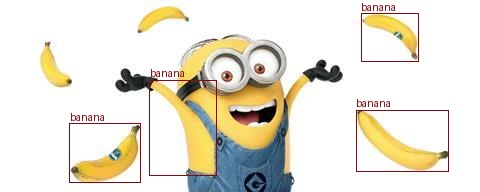

## Setting up YOLO

Start by pulling the latest docker image:
```bash
sudo docker pull staffmitrss/racecar-real:latest
```

Please take a look at `model/detector.py`. We've provided a basic template for a [YOLO11](https://docs.ultralytics.com/models/yolo11/) object detector. It's up to you to decide how you want to use this model to complete the tasks assigned to you by Gru. Feel free to modify the code as needed or dive into the original [YOLO source code](https://docs.ultralytics.com/) to see how you can make the most out of the model (not required, feel free to just use what we've provided)!

You should give this file a careful read. But importantly, note that you can control the model's threshold, which determines how confident the model needs to be before it considers an object detected. The default threshold is set to 0.5, but you can adjust it to suit your needs. A lower threshold will yield more detections, while a higher threshold will yield fewer detections. Additionally, observe that the `predict` function gives you the list of `(bounding box, class_label)` pairs. You can see the list of all classes supported by the model with 
```python
model = Detector()
print(model.classes)
```

To get you started, you can run the demo to detect the bananas around the minion with

```bash
python3 model/detector.py 
```
which will save the output image with bounding boxes (as below) to `model/demo_output.ppg`. 





**Fun Fact**: Gru has no patience for sluggish models, so he harnessed TensorRT’s quantization and optimizations to supercharge yours! If you're curious / want to learn more about how he did it, check out [this](https://developer.nvidia.com/tensorrt#:~:text=NVIDIA%C2%AE%20TensorRT%E2%84%A2%20is,high%20throughput%20for%20production%20applications) and [this](https://huggingface.co/docs/optimum/en/concept_guides/quantization) as a reference.

We recommend you increase the power mode of the Orin:

```bash
# to check the current power mode
sudo nvpmodel -q

# to change to MAXN_SUPER mode
sudo nvpmodel -m 2

# confirm with
sudo nvpmodel -q

# reboot
sudo reboot
``` 

**Note,** in the unlikely case it helps, you can try the alternative of just putting the model on cuda directly. To do this, replace
```python
model = Detector()
```
with
```python
model = Detector(from_tensor_rt=False)
model.to('cuda')
```

For context, the model should run at about 20FPS. 
